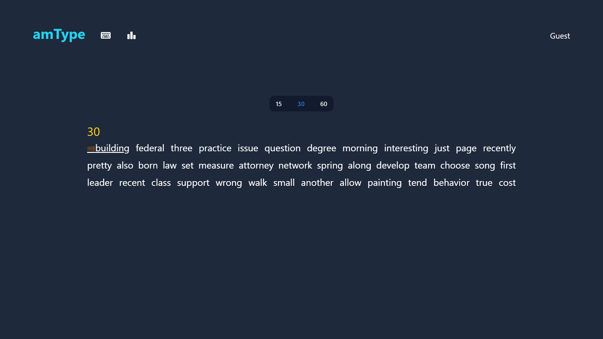
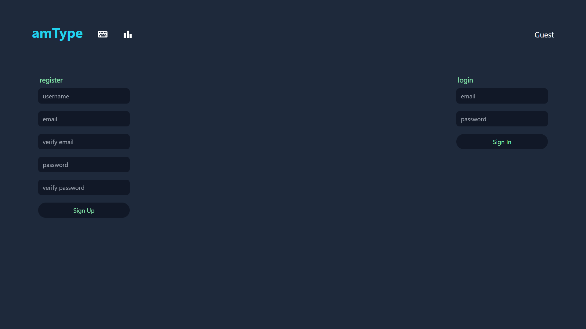

# amType

## About

amType is a Typing Speed Test application inspired by [monkeytype](https://monkeytype.com/).

Live Preview: https://amtype-monkeytypeclone.netlify.app

## Features

- Fullscreen mode
- Cross platform
- Account system
- Live errors and timer
- Collection of around 1000 english words
- Three types of test lengths

## Tech Stack

**Client:** React, TailwindCSS, React-Awesome-Reveal

**Server:** Node, Express, MongoDB

## Screenshots

# App Demo Video

https://github.com/user-attachments/assets/f0564049-e705-462b-bc40-90901bdc9e97

